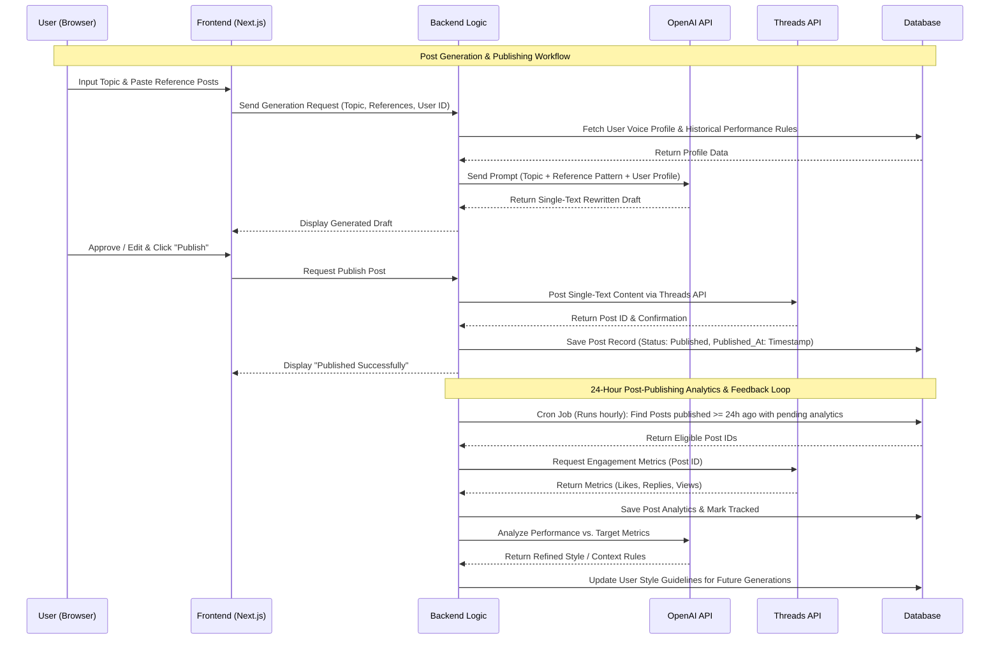
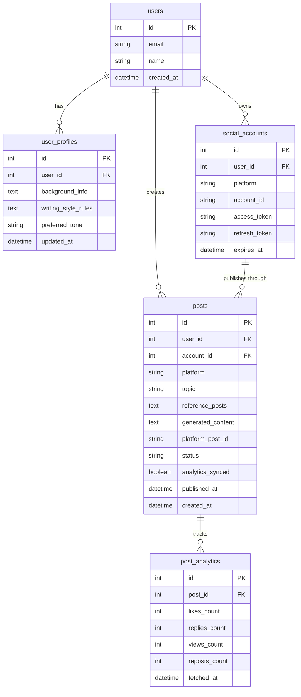

# PRD — Product Requirements Document

## 1. Overview
This application aims to streamline and automate high-performing social media content creation, specifically tailored for **Threads** (with future adaptability for platforms like X/Twitter). The core problem it solves is the time-consuming process of analyzing viral content patterns, adapting them into an authentic voice, and measuring post performance manually.

The primary goal of the application is to provide a simple, web-based MVP where users can manage their personal voice profiles, leverage LLM capabilities to analyze reference posts, generate personalized content, directly publish to Threads via official APIs, and automatically gather analytics to refine future content generations over time.

---

## 2. Requirements
Below are the high-level requirements for the system development:
- **Accessibility:** Accessible via Web Browser, optimized for desktop usage (content creation, review, and analytics monitoring).
- **Target User:** Content creators, personal brands, and developers managing individual profile automation.
- **Authentication:** Multi-account / Single-user OAuth 2.0 integration via official Threads API.
- **Core Engine:** AI integration powered by OpenAI API for post analysis and synthesis.
- **Format Scope:** MVP focuses strictly on single-text posts (multithread/carousel support deferred to post-MVP).
- **Extensibility:** Platform-agnostic schema and service design to ensure X (Twitter) integration can be added seamlessly with minimal refactoring.
- **Personalization:** User context management storing writing styles, bio/background details, tone guidelines, and past high-performing content rules.

---

## 3. Core Features
Key features required for the Minimum Viable Product (MVP):

1. **User Profile & Style Management**
   - Interface to define personal brand background, tone of voice, preferred formatting, and custom instructions for AI generation.
2. **Content Generation Workspace**
   - **Topic Input:** Text field to input the core topic/idea.
   - **Reference Posts Input:** Manual paste section for one or more high-performing reference post URLs/texts.
   - **AI Analysis & Rewrite Engine:** Structural/style analysis combining user background and reference posts to output an original, personalized single-text post draft.
3. **Review & Publishing System**
   - Single-text draft editor with live character count and preview capability.
   - Direct publishing to Threads via the official API.
4. **Analytics & Performance Tracking**
   - Dashboard displaying performance metrics (likes, replies, views) fetched via the API.
   - Automated metric sync scheduled 24 hours post-publishing.
5. **AI Feedback Loop**
   - Performance analysis agent that extracts insights from top-performing published posts to automatically update user style prompts for future iterations.

---

## 4. User Flow
The simplified workflow for the user:

1. **Authentication:** User logs in and connects their Threads account via OAuth 2.0.
2. **Setup Profile:** User configures their personal background, target audience, and preferred writing style.
3. **Generation Process:**
   - User inputs a topic and pastes reference post examples.
   - AI processes reference patterns against user profile guidelines.
   - System renders single-text draft options in the editor.
4. **Publishing:** User reviews/edits the generated post and clicks "Publish to Threads".
5. **Insights & Feedback:**
   - System runs a scheduled cron job 24 hours after publication to fetch engagement metrics (likes, views, replies).
   - AI analyzes metric data to log insights and refine future content prompt strategies.

---

## 5. Architecture
Below is the technical sequence diagram illustrating the data flow from generation to analytics feedback:

---

## 6. Database Schema

The Entity Relationship Diagram (ERD) below uses platform-agnostic design (`platform` enum field) to easily support X (Twitter) in future iterations:

| Table | Description |
|---|---|
| **users** | Primary user account information |
| **user_profiles** | Personal background, writing style guidelines, and tone preferences for AI contextualization |
| **social_accounts** | Connected social platforms (e.g., Threads, X) storing OAuth tokens |
| **posts** | Stores topic inputs, references, generated single-text drafts, publication status, and analytics sync flag |
| **post_analytics** | Historical performance metrics fetched via external APIs 24 hours after publishing |

---

## 7. Design & Technical Constraints

1. **High-Level Technology & Architecture:**
   - The platform should be built on modern, rapid-development frameworks (e.g., Next.js, Node.js) with modular service layers (e.g., dedicated abstract provider interfaces for `SocialPlatformService` and `AIService`).
   - Adding X (Twitter) support in the future must only require implementing an additional platform driver without altering core logic or database structure.

2. **API & Automated Analytics Execution:**
   - External APIs (OpenAI, Threads, X) must be handled through rate-limited queue workers to prevent execution timeouts and platform throttling.
   - The engagement fetching routine runs as a background cron worker targeting posts exactly 24 hours after their `published_at` timestamp.
   - Graceful fallback mechanisms must be implemented when analytics or posting endpoints are temporarily unavailable.

3. **Typography Rules:**
   - To ensure visual consistency across the dashboard interface, the UI must use the following font configurations:
     - **Sans:** `Geist Mono, ui-monospace, monospace`
     - **Serif:** `serif`
     - **Mono:** `JetBrains Mono, monospace`